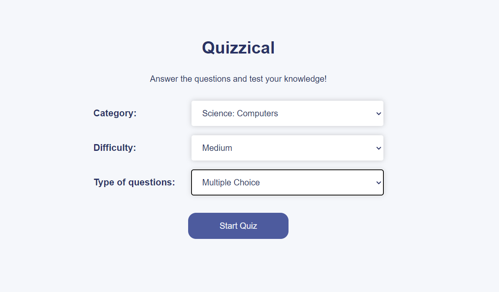
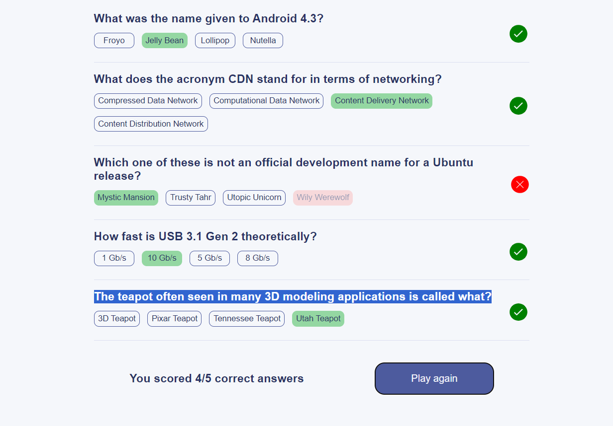
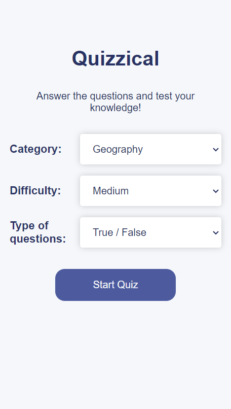
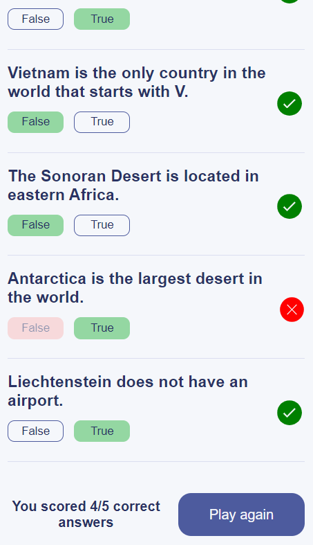

# React Quizz 

## Description
The Quiz App is a web application built using React and Vite. It allows users to answer questions based on their chosen difficulty level, category (including various topics and current affairs), and the type of questions (Multiple Choice and True or False).

## URL
You can access the live app at [React Quizz](https://eshans-quizz-app.netlify.app/).

## Screenshots
### Desktop

### Mobile

## Technologies Used

- 
- 
- 

- 

- 

-  
-  

## Features
- User can select the difficulty level (Easy, Medium, or Hard).
- User can choose a category from various topics or current affairs.
- User can select the type of questions (Multiple Choice or True or False).
- The app provides a score based on the user's answers.

## License
This project is licensed under the MIT License - see the [LICENSE](LICENSE) file for details.

## Installation
1. Clone the repository.
2. Install dependencies: `npm install` or `yarn install`.
3. Start the development server: `npm run dev` or `yarn dev`.

## Usage
1. Open the app in your web browser.
2. Select the desired difficulty level, category, and question type.
3. Start the quiz and answer the questions.
4. View your score at the end of the quiz.

## Contributing
Contributions are welcome! Please open an issue or submit a pull request.

## Authors
- [Eshan Shikarkhane](https://github.com/eshan-one)

## Acknowledgments
- Thanks to [OpenAI](https://openai.com) for assistance with this README template.

